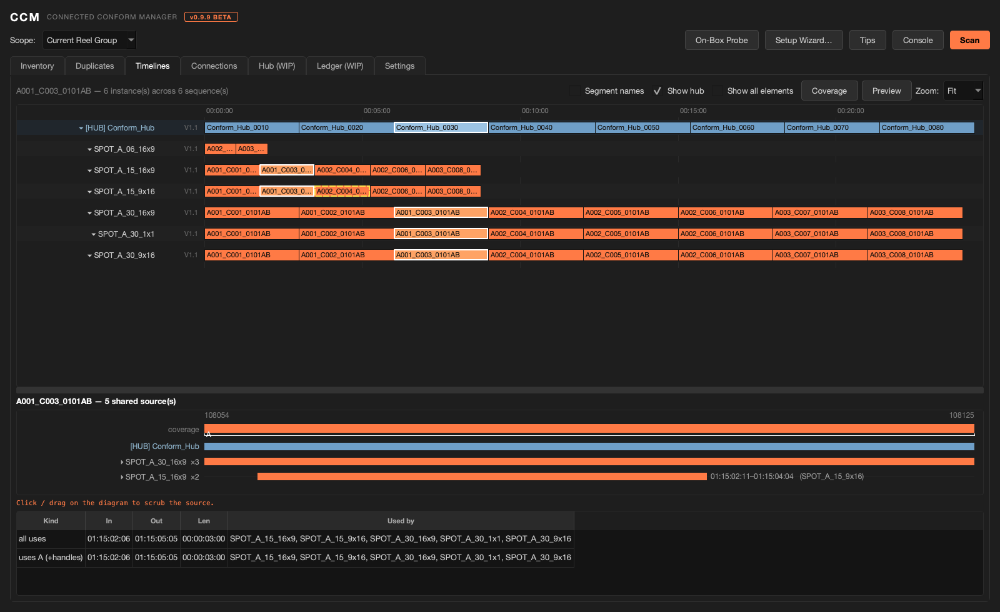

# Connected Conform Manager

A Flame tool for **connected conforms**: one scan of every sequence in a scope
shows which segments are the same shot, which share one real source and which
have quietly split — across every spot and aspect version, in one window.

Built around the **Conform Hub**: the one sequence that holds every shot of the
job once, covering every frame any spot shows of it.

> Status: 0.9.9 (beta) — the first public release; see the [Changelog](#changelog).
> The audits and views are used on real jobs; the **Hub** and **Ledger** tabs are
> in development. Read [Known limitations](#known-limitations) before running it
> on production work.



---

## TLDR

- **Scan** every sequence in a Scope once; every tab works from that one scan.
- Find the shots that have **split into separate real sources** (the same shot
  conformed twice, or re-delivered), compare them frame for frame, and
  **Merge into Primary** — each copy keeps its own cut and Timeline FX, and the
  merge checks itself afterwards.
- See every sequence as a lane on one scale in the **Timelines** tab: click a
  shot to light it up everywhere it's used and see how much of its source each
  use takes.
- See which uses are **connected** to the hub, which only share its source and
  which aren't in the hub at all, in the **Connections** tab.
- Audit or build a **Conform Hub** *(in development)*: every shot covering every
  frame the spots show, timewarps included, with stacked pieces when a shot
  exists as several real sources.

**Read-only by default.** Nothing on a timeline changes until you allow it in
Settings, and every change asks first.

---


## How it works

CCM reads; Flame stays the source of truth. One **Scan** walks every sequence in
the Scope and records each segment that carries real media — its source, source
range, record position, timewarp and track. From that it works out three things:

- which segments are the **same shot** — the camera / roll name plus overlapping
  source timecode (and, by default, matching source names);
- which share **one real source** — Flame's own shared-source relation, the one
  behind right-click → Jump to Shared Source Segment;
- which are **connected** — Flame's segment connections, read when you open the
  Connections tab.

Every segment also gets a role: **Shots / footage**, **Graphics**, **Reference**,
**FX / elements**, **Slate** or **Published Hub Track (archive)**. Only Shots /
footage feed the conform audits and the hub. CCM guesses the role (a segment
that spans most of its sequence, or is named "ref", looks like a reference; a
slate sits just before the hour), and you correct it with the **Setup Wizard…**
or the Inventory's **Set role:** list.

Everything is re-derived on every scan. What's saved per project is mainly what
a scan can't reconstruct: your duplicate verdicts, role corrections, track roles,
which sequences are hubs and where media ends (learned by a hub build), plus the
preview cache.

### Tabs

- **Inventory** — every segment in scope carrying real linked media (the hub
  excluded): Sequence, Name, Camera, Source, Src In / Src Out, Dur, Rec In, Role,
  Dup (duplicate set), Stack (split-screen / multi-element overlap), Warp
  (timewarped) and Long (★ = the longest use of a shot used more than once).
  **Units:** switches Timecode / Frames, **Columns ▾** shows / hides columns, and
  **Only show sources** hides everything that isn't shots / footage. Anything
  that isn't a shot shows dimmed; `ref?` (amber) is an ambiguous call that stays
  a source until you decide. Select rows and pick a role from **Set role:** —
  `*` marks your call, `(track)` the Setup Wizard's; **(let CCM decide)** forgets
  it.
- **Duplicates** — the inbox. Every import mints its own under-the-hood source,
  so the same shot conformed on different days (or re-delivered by color prep)
  silently splits into separate real sources that can drift apart. Each block is
  one shot that exists as several copies; one shared source across them is
  intended reuse ✓, a **split source** needs a verdict. **Show:** Shots /
  Graphics / Both; **Show resolved too** adds the blocks that already share one
  source or that you've ruled on.
  - **Compare Sources** — puts the copies side by side at the same source frame,
    with a measured difference against the primary and a **Frame:** slider. The
    first bake takes a few seconds per copy; after that it's cached.
  - **Merge into Primary…** — one source wins everywhere. Each duplicate's media
    is replaced with the primary's real source and it keeps its own cut and
    Timeline FX. CCM copies from a use of the primary that covers the
    duplicate's frames; if none does, from the primary's Conform Hub piece; and
    failing that, from any use when the source media itself holds the frames
    (the frames past that use's cut come from the media). Afterwards it
    re-reads Flame's shared-source relation — the same check that flagged it —
    and only reports ✓ when the source is truly shared. A timewarp whose curve
    can't be read, and a duplicate nothing of the primary covers, are skipped
    and listed. **Scan** is locked while it runs.
  - **Keep Both (Variants)** — the copies differ on purpose (a separate grade,
    say). Both stay in the conform as elements of the same shot — amber, not
    red — each with its own hub piece, stacked under one shot name.
  - **Un-mark** — sends an acknowledged block back to undecided.
- **Timelines** — every sequence as a lane on one shared scale, hub lane first,
  all tracks stacked. Orange = source, purple = timewarped, blue = hub (dim blue
  = a Publish snapshot), dim grey = reference. Edges: red = split source awaiting
  a verdict, amber = acknowledged variant, dashed yellow = not in the hub (its
  source has no hub piece). Click a shot to light it up in every lane;
  double-click to go there in Flame; click a sequence's name to fold it to one
  strip; right-click a track name or a block to correct its role.
  **Segment names** labels blocks with the segment name instead of the shot
  name, **Show hub** shows / hides the hub lane (it's usually the longest and
  shrinks the rest), **Show all elements** brings back references, graphics and
  FX, and **Zoom:** stretches the scale (Fit–600%).
  - **Coverage** — the drawer under the lanes: the clicked shot's whole source,
    the frames each sequence uses, the smallest pieces that cover them (plus
    **Handle frames**) and the unused middle shaded as a trim candidate. Click or
    drag on it to scrub the source and see who uses that frame.
- **Connections** — the cut-flow braid: the hub on top, every sequence as a lane,
  each shot a block in record order and a ribbon following the same shot from
  lane to lane. Orange = connected to its hub piece, blue = shares the hub's
  source but isn't connected, dashed yellow = not in the hub, grey = connections
  not read. Beside it, the shot list (**Conn.** and **Shared** count the uses
  connected to / sharing a source with the hub piece); below it, the picked
  shot's family tree (hub piece on top, spots by length). **Fold identical cuts**
  merges sequences with exactly the same cut (the aspect versions of one spot,
  say) into one lane, **Tree** shows / hides the family tree, and **Re-read
  Connections** reads them from Flame again without a full Scan. Double-click
  selects that shot's connected segments in Flame — the only thing this tab
  touches.
- **Hub (WIP)** — the Conform Hub audit, one row per shot: Shot Name, Status
  (✓ named · ✗ no shot name · ✗ MISSING, a spot uses it but the hub doesn't
  have it · ✗ pub only, only on a publish copy of the hub), Segment Name, Alts
  (live pieces, when more than one), Consumers, and Coverage — does the hub
  hold every frame the spots show, timewarps included, and no more? Hover a
  Coverage cell for every use and which one sets the tail. **HUB ACTIONS:**
  - **Create Conform Hub…** — builds a new hub from every shot the spots use,
    in source-TC order or the record order of a sequence you pick (see
    [The Conform Hub](#the-conform-hub)).
  - **Create Source Segment Connections…** — Flame's Python API has no
    scriptable Create Source Segment Connections, so this walks you through
    Flame's own step, then **I ran it — Verify now** counts which spot segments
    actually connected. **Unify media + segment connections (not source)** gives
    the uses each hub piece covers the hub's media and a regular segment
    connection — not a Source Segment Connection.
  - **Renumber / Rename Shots…** — renames every live hub shot to
    `<hub name>_0010`, `_0020`, … in record order; a stacked shot takes one name.
  - **Remove from Hub…** — deletes the selected shots' hub segments (a ref that
    slipped in, say) and tries to close the gap. Experimental.
- **Ledger (WIP)** — one row per hub shot showing how far it has got through
  publishing: Shot, Hub Name, Forks, Snapshots, Openclip, Current, Latest and
  State (an **OFF-LATEST** openclip has a newer version than the one in use).
  **Prep Publish…** puts a frozen copy of each selected shot — copied, unlinked
  and given its own source — on a Publish NN track for Flame's own publish to
  run on; **Fix mode (replace current version)** re-does a bad publish on its
  existing track.
- **Settings** — **Conform Hub name** (Flame's "Sources Sequence" is always
  recognised too), **Default scope**, **Handle frames**, **Merge gap frames**,
  **Camera token** / **Camera match chars** (how the camera / roll name CCM groups
  by is read), **Ref span threshold** / **Ref name tokens** (reference
  detection), **Snapshot into** / **Publish tracks grow** (Ledger), **Mutations**
  and **State folder**. **Save Settings** saves and rescans.

> **In development: the Hub (WIP) and Ledger (WIP) tabs.** Flame's Python API has
> no scriptable Create Source Segment Connections (scoped) and no Duplicate
> Connected Segment, and the connect → publish workflow these tabs are built for
> depends on both. CCM hands those steps to Flame's native tools and checks the
> result. Both tabs carry a banner that says so — use them on a copy of a job,
> not on a delivery.

### The Conform Hub

The Conform Hub is the sources / shots sequence: every shot the spots use, once.
Name it in Settings (**Conform Hub name**, default `Conform_Hub`) or tick
**This sequence is the CONFORM HUB** in the Setup Wizard.

**Create Conform Hub…** builds each piece to cover **every frame any spot shows
of that shot**, and a timewarp is measured
by the frames it actually displays (its curve read frame by frame), not by its
nominal source range. A shot that exists as several real sources — kept as
variants, or re-imported grades — becomes **one shot with stacked pieces**: the
longest on the base track, the others above it, under one shot name. Every piece
is read back from Flame once it's placed, and anything short, failed or missing
is reported. Creating a hub also sets **Conform Hub name** in Settings to it, so
the Hub and Ledger tabs audit the new hub.

### Changing the project

- **Off by default.** With **Allow CCM to CHANGE the project** (Settings →
  Mutations) off, CCM doesn't change your timelines. A button that would change
  something says so and offers to switch it on. The switch is per user and stays
  on — for every project, across restarts — until you turn it off.
- **Every change asks first**, saying what it will do.
- **Undo.** Merge into Primary, Remove from Hub, Unify media and Prep Publish can
  be undone in Flame. Create Conform Hub builds a new sequence (delete it to
  undo); Renumber rewrites shot names.
- **You stay where you were.** After a change CCM rescans the same sequences and
  re-opens the sequence you were on at the same frame.
- **Temporary clips.** Anything that copies media — Merge, preview bakes, Compare
  Sources, Prep Publish, Unify — makes a temporary clip in the first reel of
  your Desktop (a hub build uses the hub's own reel) and deletes it again; one
  that can't be deleted is reported in the Console. Even with changes off,
  previews and Compare Sources do this, and opening CCM switches Flame to the
  Timeline tab.

### The shot preview

One picture panel, shared by Timelines, Connections, Hub and Ledger, with one
**Preview** switch for all of them. Scrub it (drag the bar or the picture, the
wheel on the bar, ←/→, shift = 10 frames) and zoom it. The first look at a
shot bakes its frames (a few seconds); they're cached in the project, so every
later look is instant, in every tab. **Re-bake** bakes a shot again after its
media changed; **Bake All** bakes every shot in the scan that doesn't have a
preview. The timeline is never touched.


## Installation

Developed on Flame 2027; runs on 2026.2 and later. Requires PySide6 (Flame 2025+
ships it).

Copy **only** `flame_ccm.py` into its own folder on Flame's shared Python path
and fully restart Flame:

```
/opt/Autodesk/shared/python/flame_ccm/flame_ccm.py
```

> **Copy the one file, never the repo.** Flame loads every `.py` under its shared
> python path at launch — clone or copy the whole repo there and it runs the
> other files too.

Writing to `/opt/Autodesk/shared/python` may need admin rights. To upgrade,
replace the file and restart Flame. To uninstall, delete the `flame_ccm` folder
(and, if you like, the settings file and the projects' `flame_ccm` folders below).

- **Settings** are per user, in `~/flame/flame_ccm_settings.json`.
- **Per-project state** (`conform_state.json`: duplicate verdicts, role
  corrections, track roles, hub names, media ends) and the preview cache live in
  the project's setups folder under `flame_ccm/`. **State folder** in Settings
  points CCM at a different folder instead — it doesn't move existing files, and
  because settings are per user, every project then shares that folder.


## Usage

Open it from any of:

- Right-click a timeline segment → **Connected Conform Manager → Open…** (or
  **Jump to Shot in Timelines…** to land on that segment's shot)
- Right-click in the Media Panel → **Connected Conform Manager → Open…**
- Flame main menu → **Connected Conform Manager → Open Manager…**

The window doesn't block Flame: keep working with it open, and press **Scan**
after changing things in Flame. Along the top: **Scope:** · **On-Box Probe**
(read-only diagnostics written to `flame_ccm_probe.txt` next to the script, or
in your home folder if that isn't writable; names and paths are anonymized by
default — `probe_anonymize` in the settings file — but it lists project and
storage ids, so review it before sharing) · **Setup Wizard…** · **Tips** (the
explanations under each view) · **Console** (the message log) · **Scan**.
Hover the **BETA** tag in the header for what's unfinished.

Typical flow:

1. **Setup Wizard…** — on a big job, the first thing to run. Go sequence by
   sequence, say what each track holds and which sequence is the Conform Hub;
   **Apply to all sequences** copies the answers to every sequence with a
   same-named track. Nothing on the timeline is touched.
2. **Scan**, then check the **Inventory** — fix any role CCM got wrong.
3. **Duplicates** — give every split source a verdict: **Compare Sources**, then
   **Merge into Primary…** or **Keep Both (Variants)**.
4. **Timelines** and **Connections** — check where every shot is used, how much
   of its source it takes, and how it's connected.
5. **Hub (WIP)** — check the Conform Hub holds every frame the spots show, or
   build one with **Create Conform Hub…** (on a copy of the job).

Scopes (top of the window): **Selected Sequences · Current Reel · Current Reel
Group · Current Desktop · Open Sequences**. Selected Sequences uses what's
selected in the Media Panel; the others follow what's open in Flame's
**Timeline** tab (CCM switches you there on open).


## Known limitations

- **Source Segment Connections aren't scriptable.** Flame's Python API has no
  scriptable Create Source Segment Connections (scoped) and no Duplicate
  Connected Segment, so CCM walks you through Flame's own step and verifies the
  result.
- **A new Conform Hub can start with a 1-frame gap at its head.** CCM tries to
  close it; if one is left, delete it by hand.
- **Mixed-rate jobs:** record timecodes are shown at the source rate.
- **Compare Sources' difference thresholds are untuned.** Judge the pictures,
  not just the number.
- **A timewarp whose curve can't be read** is skipped by Merge into Primary
  (and listed in the Console) and isn't checked by the Hub audit.
- **Preview bakes run in the foreground.** Flame waits while a shot bakes — a few
  seconds each, the first time; **Bake All** on a big job takes a while.
- **Every scope except Selected Sequences is measured from the sequence open in
  the Timeline.** Open the right sequence before you Scan; **Open Sequences**
  covers its whole Desktop.
- **Remove from Hub is experimental.** Check the hub afterwards.
- **The Ledger and Prep Publish are in development** — the publish workflow
  they belong to depends on the two steps Flame's Python API can't run.


## Changelog

### 0.9.9
- First public release (beta).
- **Duplicates inbox** with **Compare Sources**, **Merge into Primary…** and
  **Keep Both (Variants)**. Merge keeps each copy's cut and Timeline FX and
  checks that the source is truly shared afterwards.
- **Merge into Primary handles cut-downs no single use covers:** it copies from
  the primary's Conform Hub piece, or from any use when the source media itself
  holds the frames.
- **Timelines** map with the **Coverage** drawer, **Connections** braid and
  family tree, and one scrubbable **shot preview** shared across the tabs.
- **Conform Hub** audit and **Create Conform Hub…** — every shot covering every
  frame the spots show, timewarps included, stacked pieces for several real
  sources (in development).
- **Read-only by default**; every change asks first and leaves you on the
  sequence and frame you were on.

## Credits

Written by **Jeff Kyle**. Built with Claude (Anthropic).

## License

MIT — see [LICENSE](LICENSE).
